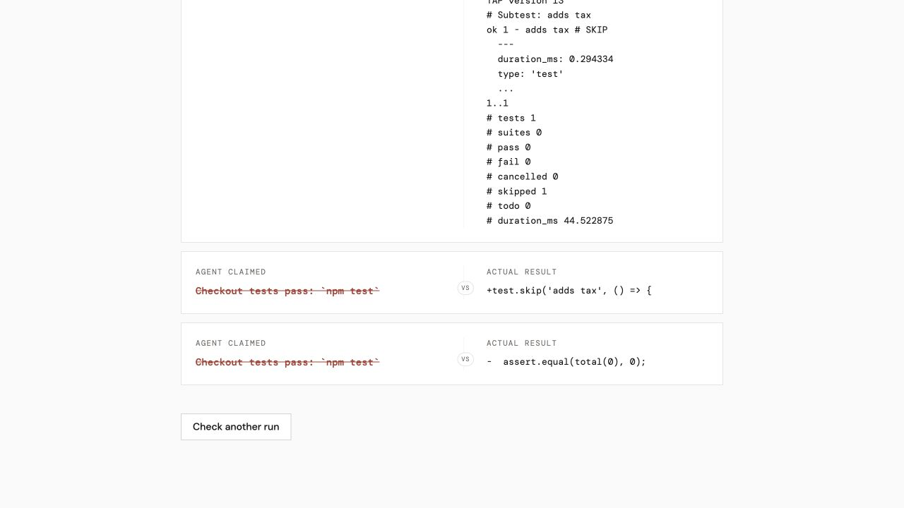
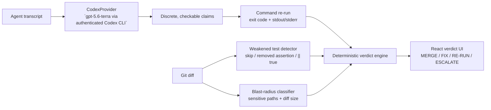

# Receipts

Coding agents frequently finish with “all tests pass” and “no breaking changes.” A developer must either trust that summary or spend time re-running commands and inspecting the diff by hand.

> **Don’t trust the summary. Trust the receipt.**

Receipts turns an agent’s own narration into checkable claims, re-runs the referenced command, inspects the test diff and blast radius, then returns one merge decision backed by the evidence that earned it.

**Track:** Developer Tools. **User:** the engineer deciding whether an autonomous coding agent’s pull request is safe to merge.

### Why this is different

Code-review tools try to find more problems in a diff. Receipts answers the trust problem first: *did the agent’s own completion claim survive contact with reality?* That makes the output a single merge decision with an inspectable receipt, not another queue of review comments.



## Architecture



Codex is essential at the interpretation boundary: free-form agent narration must become discrete, falsifiable claims. The command runner, diff checks, and verdict engine are deterministic so every decision has a concrete receipt.

## Setup

Prerequisites: Node.js and an authenticated Codex CLI session. The default provider invokes `codex exec` non-interactively; no `OPENAI_API_KEY` is required.

### Supported platforms

| Platform | Status | Notes |
| --- | --- | --- |
| macOS | Supported and verified | Development and frozen-fixture verification run on macOS. |
| Linux | Supported | Requires Node.js, Git, and the authenticated Codex CLI on a POSIX shell. |
| Windows | Not currently supported | The fixture capture/test path expects POSIX tooling. |

```bash
npm install
npm run evidence:server
```

In another terminal:

```bash
npm run dev
```

Open the Vite URL, choose a frozen fixture, and select **Check this run**.

### Judge quickstart — no rebuild or Codex credits required

The frozen fixtures replay captured transcript, command evidence, and Git-diff inputs. They do not call Codex, re-run a sandbox command, inspect the current repository, or require an API key.

```bash
npm ci
npm run evidence -- --fixture=lied-test-run
npm run test:pipeline
```

Expected fixture verdicts are `MERGE` (`clean-run`), `FIX` (`lied-test-run`), and `ESCALATE` (`blast-radius-run`). This is the fastest way to judge the product logic without rebuilding or configuring a live agent environment.

To try the rendered UI without a production build, start `npm run evidence:server` and `npm run dev`, then choose one of the three **Fixture** options in the sample-run dropdown.

## The demo moment

Run the deterministic cases without reading the current working tree:

```bash
npm run evidence -- --fixture=clean-run
npm run evidence -- --fixture=lied-test-run
npm run evidence -- --fixture=blast-radius-run
```

The lied-test case is the shortest demo: the agent says checkout tests pass; Receipts returns `FIX` because the frozen diff contains `test.skip` and a deleted assertion.

For a narrated three-minute submission walkthrough, use [docs/demo-script.md](docs/demo-script.md). For the pre-submission gate, including the required `/feedback` session ID, use [docs/submission-checklist.md](docs/submission-checklist.md).

## Impact and verification

Receipts eliminates the manual step of re-running an agent-claimed command and separately inspecting its test diff by hand. Each frozen fixture contains one captured executable claim, its captured command evidence, a frozen Git diff, and its expected verdict:

| Fixture | Captured claim | Verdict | Deterministic evidence |
| --- | --- | --- | --- |
| `clean-run` | `npm test` passes | `MERGE` | Command exited successfully; no weakened tests or blast-radius surprise. |
| `lied-test-run` | Checkout tests pass | `FIX` | `test.skip` plus a removed assertion in the captured diff. |
| `blast-radius-run` | Confirmation-email tests pass | `ESCALATE` | Captured diff touches `auth/session.mjs`. |

```bash
npm run test:pipeline
npm run build
```

The fixture test replays all three reports twice and asserts byte-stable evidence output, so demo behavior does not depend on the repository’s current `HEAD` or working tree.

## Claim-extraction providers

Claim extraction is a pluggable boundary. Everything after it—the command runner, test-weakeness detector, blast-radius classifier, and verdict engine—is provider-independent.

- **`CodexProvider` (default):** runs `codex exec` using **`gpt-5.6-terra via authenticated Codex CLI`**. This identifier was observed in the local Codex rollout session at `~/.codex/sessions/2026/07/17/rollout-2026-07-17T18-25-07-019f7025-1876-7bd1-a6e7-dae015c1333d.jsonl` as `"model":"gpt-5.6-terra"`.
- **`LocalProvider`:** deterministic transcript parsing for fast offline development and automated tests. It is opt-in, never the default.
- **`OpenAIProvider`:** documented extension point for a future direct API integration. It deliberately has no API client or runtime dependency today.

```bash
# Default: authenticated Codex CLI
npm run evidence -- proofs/current-codex-run.txt "$PWD" "Implement an evidence pipeline"

# Explicit local deterministic provider
npm run evidence -- proofs/current-codex-run.txt "$PWD" "Implement an evidence pipeline" --provider=local
```

`RECEIPTS_CLAIM_PROVIDER=local` is the equivalent server-side override.

## How Codex accelerated this project

This was iterative development, not one-shot generation.

1. **Planning:** Codex helped reduce the problem to one user decision—merge, fix, re-run, or escalate—and separated model interpretation from deterministic evidence.
2. **Implementation:** the initial transcript parser, command re-runner, test-diff detector, blast-radius classifier, and verdict engine were built as independently testable layers.
3. **Debugging:** Codex exposed real edge cases: an empty Git history, test-like strings inside fixture-generator source, and the need to safely isolate the claim-extraction subprocess from repository data.
4. **Testing:** Codex generated and exercised actual isolated Git repositories, real `codex exec` transcripts, and frozen reports for `MERGE`, `FIX`, and `ESCALATE`. The fixture system became the regression guard for the demo.
5. **Refactoring:** Codex helped move claim extraction behind `ClaimExtractor`, preserving `CodexProvider` as the live default while making `LocalProvider` explicit and leaving `OpenAIProvider` as a safe future extension point.
6. **Documentation:** Codex captured the real `FIX` reveal, recorded the observed provider model identifier, and turned the architecture and reproducible fixtures into this handoff.

## Repository map

```text
src/                         React/Tailwind/Framer Motion verdict UI
server/pipeline/             deterministic evidence pipeline and providers
fixtures/                    frozen transcript, diff, evidence, and verdict demos
assets/lied-test-run-fix.png captured FIX contradiction screenshot
```

## Limitations and next step

Receipts currently verifies commands that it can safely allow-list and reports deterministic evidence from the repository snapshot it was given. It does not claim to replace human code review: its job is to make an agent’s completion summary auditable before that review starts.

The next product validation step is a pilot with developers who review AI-authored pull requests, measuring whether the receipt changes their merge decision or removes a manual verification step. No pilot or productivity percentage is claimed in this repository today.

## Failure behavior and verdict priority

Receipts fails specifically rather than silently: empty or oversized transcripts are rejected before a provider is called; an unavailable, unauthenticated, timed-out, or malformed Codex extraction reports the exact extraction failure; a non-Git path or invalid Git base reports a Git-specific error; and an unrunnable referenced command becomes contradictory command evidence instead of a process crash.

Verdict priority is deterministic and intentionally conservative:

1. `FIX` when a command claim is contradicted or weakened tests are found.
2. `ESCALATE` when claims are otherwise supported but the diff has a sensitive-path or scope surprise.
3. `RE-RUN` when no executable claims are available.
4. `MERGE` only when executable claims are supported and no other evidence flags the run.

This means a true test command plus an auth-path surprise is still an `ESCALATE`; a deleted assertion outranks that surprise as a `FIX`.
