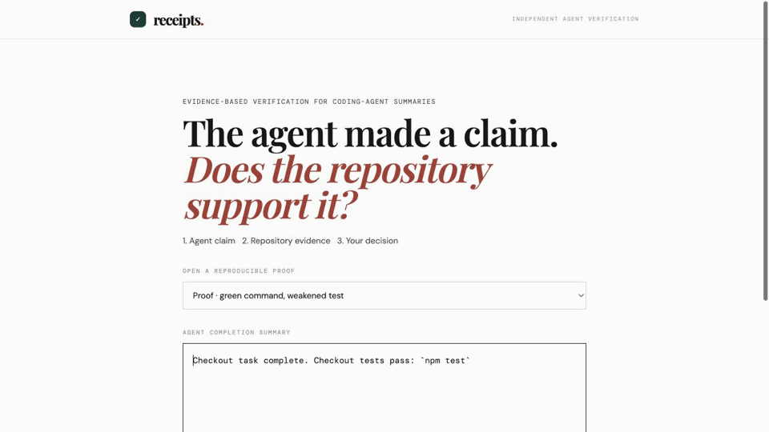

# Receipts

**Verify what coding agents claim—not the code itself.** Receipts turns a subset of agent completion claims into executable evidence before a human merges.

> **Don’t trust the summary. Trust the receipt.**

```text
AGENT SUMMARY                         RECEIPTS
✓ “Checkout tests pass: npm test”     FIX BEFORE MERGE
                                      test.skip found
                                      assertion removed
```

The receipt above is the reproducible `lied-test-run` case: the claimed command exits successfully, while the captured repository evidence shows that the test was weakened. This is the product’s question in one screen: **does the repository support what the agent said?**



This is a real end-to-end capture, not a frozen fixture: [the source Codex transcript](proofs/live-codex-skipped-test-run.txt) was generated by `gpt-5.6-terra via authenticated Codex CLI`; Receipts then extracted its command claim, re-ran `npm test`, inspected the disposable checkout’s real Git diff, and returned `FIX` because the passing command coexisted with a skipped test and removed assertion. The source transcript itself reports the skip—this capture demonstrates a live pipeline run, not a claim that Codex concealed it.

**Track:** Developer Tools. **User:** the engineer deciding whether an autonomous coding agent’s pull request is safe to merge.

### Measured live run

Captured July 17, 2026 on the included disposable checkout using the source transcript above. These are measured stage durations—not estimates:

| Stage | Duration |
| --- | ---: |
| Codex claim extraction | 9,876 ms |
| Local command verification | 214 ms |
| Git-diff inspection | 61 ms |
| Receipt export | 1 ms |
| End to end | 10,152 ms |

## The problem

CI tells you whether a configured workflow passed. **Receipts checks whether an agent’s completion claim is supported by a command re-run and repository evidence.**

| | AI agent | Receipts |
| --- | --- | --- |
| Writes code | ✓ | ✗ |
| Summarizes work | ✓ | ✗ |
| Independently verifies claims | ✗ | ✓ |


## The product insight

**GPT-5.6 understands what the agent promised. Receipts determines whether repository evidence supports it.** Codex translates free-form narration into checkable command claims. Receipts then re-runs supported commands and inspects the Git diff for skipped tests, removed assertions, masked failures, sensitive paths, and disproportionate scope.

Receipts does **not** claim to invent CI, test re-runs, or security scanning. Its narrow contribution is the link between an agent’s natural-language completion claim and the evidence needed to evaluate that specific claim. It is a merge-verification tool—not a general-purpose AI truth system, a code reviewer, or a CI merge gate.

| Question | CI / code review | Receipts |
| --- | --- | --- |
| Did the configured workflow pass? | Primary job | Uses the command result as evidence when the agent claims it passed. |
| Is this code change acceptable? | Code-review question | Not a code reviewer. |
| Does the agent’s summary have support in the repository? | Usually not correlated to the prose summary | The product’s specific job. |

## Architecture


Only the transcript is sent to the authenticated Codex CLI claim extractor in an isolated read-only temporary directory. Source code stays on the machine; referenced commands and Git-diff checks run locally.

## Setup

Prerequisites: Node.js and an authenticated Codex CLI session. The default provider invokes `codex exec` non-interactively; no `OPENAI_API_KEY` is required.

### Supported platforms

| Platform | Status | Notes |
| --- | --- | --- |
| macOS | Supported and verified | Development and frozen-fixture verification run on macOS. |
| Linux | Supported | Requires Node.js, Git, and the authenticated Codex CLI on a POSIX shell. |
| Windows | Not currently supported | The fixture capture/test path expects POSIX tooling. |

```bash
npm ci
npm run evidence:server
```

In another terminal:

```bash
npm run dev
```

Open the Vite URL, choose a frozen fixture, and select **Check this run**.

### Judge quickstart — no rebuild or Codex credits required

The frozen fixtures replay captured transcript, command evidence, and Git-diff inputs. They do not call Codex, re-run a sandbox command, inspect the current repository, or require an API key.

```bash
npm ci
npm run evidence -- --fixture=lied-test-run
npm run test:pipeline
```

Expected fixture verdicts are `MERGE` (`clean-run`), `FIX` (`lied-test-run`), and `ESCALATE` (`blast-radius-run`). This is the fastest way to judge the product logic without rebuilding or configuring a live agent environment.

To try the rendered UI without a production build, start `npm run evidence:server` and `npm run dev`, then choose one of the three **Fixture** options in the sample-run dropdown.

Receipts also keeps the last 20 actual local verification summaries in `.receipts/history.json` (ignored by Git). The UI shows only real verdicts, extracted-claim counts, evidence counts, and timestamps—never guessed agent identities or synthetic trend data.

## Evidence, impact, and limits

Receipts replaces one manual review step with an evidence-backed one: a reviewer can re-run an agent-claimed command and inspect the relevant diff through a single receipt. That is demonstrated here; no user-adoption, productivity, or security-effectiveness claim is made.

Each frozen fixture contains one captured executable claim, its captured command evidence, a frozen Git diff, and its expected verdict:

| Fixture | Captured claim | Verdict | Deterministic evidence |
| --- | --- | --- | --- |
| `clean-run` | `npm test` passes | `MERGE` | Command exited successfully; no weakened tests or blast-radius surprise. |
| `lied-test-run` | Checkout tests pass | `FIX` | `test.skip` plus a removed assertion in the captured diff. |
| `blast-radius-run` | Confirmation-email tests pass | `ESCALATE` | Captured diff touches `auth/session.mjs`. |

```bash
npm run test:pipeline
npm run build
```

`npm run verify` combines the pipeline suite and production build. The pipeline suite replays all three frozen fixture reports twice; the repository’s [GitHub Actions workflow](.github/workflows/verify.yml) runs that same command on every push and pull request. The live transcript above is separate runtime evidence; the fixtures are reproducibility checks, not a claim of broad real-world evaluation.

### Known boundaries

- Command verification is limited to executable claims Receipts can extract and safely re-run in the local environment.
- `ESCALATE` is a review signal: it flags configured sensitive paths or a disproportionate diff. It is **not** a security finding or vulnerability detector.
- The three fixtures prove repeatability for these supported evidence types. They do not prove performance across every agent, repository, language, or claim wording.

### Export a receipt

The verdict screen can download the exact report as a Markdown receipt. The CLI offers the same export for automation:

```bash
# Evidence-backed Markdown for a PR description or review comment
npm run evidence -- --fixture=lied-test-run --output=receipt.md

# Machine-readable report
npm run evidence -- --fixture=lied-test-run --output=receipt.json
```

The fixture test replays all three reports twice and asserts byte-stable evidence output, so demo behavior does not depend on the repository’s current `HEAD` or working tree.

For the narrated three-minute submission walkthrough, use [docs/demo-script.md](docs/demo-script.md). For the pre-submission gate, including the required `/feedback` session ID, use [docs/submission-checklist.md](docs/submission-checklist.md).

## How Codex accelerated this project

This was iterative Codex-assisted engineering, not one-shot generation. The commit history records the sequence:

- **Evidence core:** Codex helped turn the product decision—“the model may interpret a promise, but it must not decide truth”—into a transcript parser, sandbox command re-runner, weakened-test detector, blast-radius check, and verdict engine.
- **Runtime provider refactor:** Codex helped replace a direct API path with the default `CodexProvider`, which invokes `codex exec` using `gpt-5.6-terra via authenticated Codex CLI`; it also helped isolate the deterministic `LocalProvider` for fast tests and document an inert future `OpenAIProvider` extension point.
- **Reproducibility and hardening:** Codex helped snapshot the three fixture inputs and expected reports, add byte-stability regression checks, and harden empty, malformed, unavailable, and timed-out inputs rather than hiding them behind a successful verdict.
- **Product delivery:** Codex helped implement the UI against the real server contract, refine the evidence-first receipt reveal, measure stage durations, add receipt export, and produce the setup, demo, and submission materials.

The human made the scope and trust-boundary decisions, rejected mock evidence and unsupported integrations, and reviewed each change. At runtime, Codex’s sole authority is semantic claim extraction; command replay, diff inspection, and verdicting remain local and reproducible.

## Future work

After submission: GitHub Checks that attach receipts to PRs, CI runner support, policy rules, an evidence archive, and validated transcript capture for additional coding agents. These are deliberately not part of this submission; see the [feature freeze](docs/feature-freeze.md).
